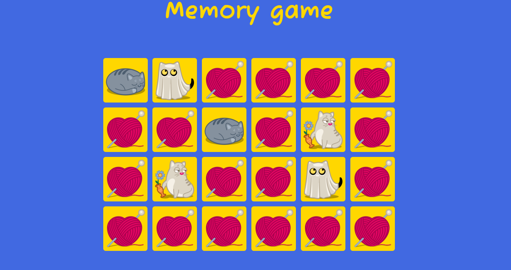

# memory-game
🕹️ Memory card game

This is a simple memory card game written in vanilla JS, with just a few functions. It consists of 24 cards with images of cute cats.

## How to run

Load this link in your browser https://angrygru.github.io/memory-game/

## How to play

The rules are very simple:
+ the playing field consists of 24 cards arranged randomly; 
+ flip two cards at a time to find the ones that match;
+ if the cards match, both cards remain upside down;
+ if the cards do not match, both cards return to their original hidden state;
+ the game ends as soon as all the cards are correctly matched.
